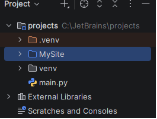
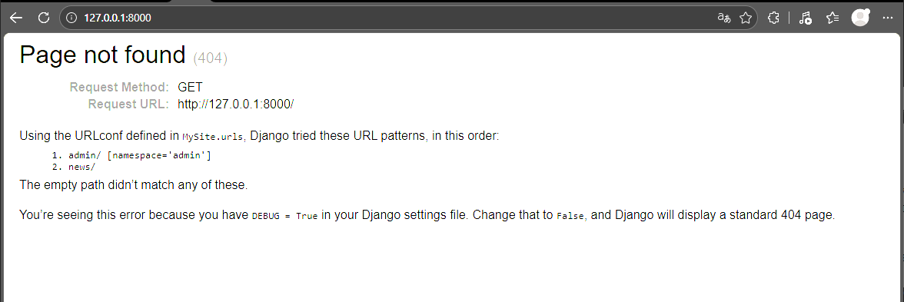
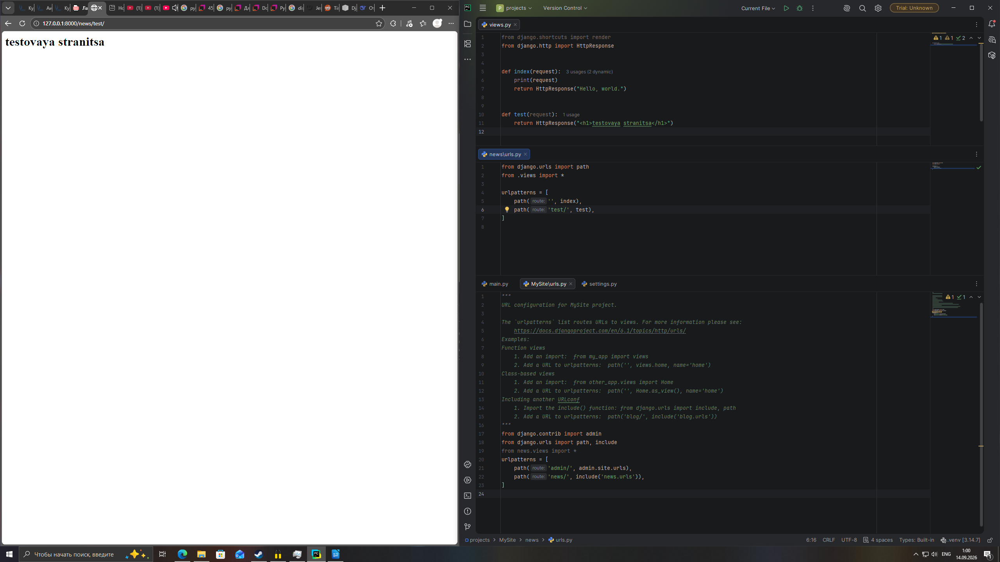

# Лабораторная работа №1: Создание виртуального окружения. Контроллеры и маршруты
 
**Студент:** Бойко Андрей Сергеевич
**Группа:** ПИЖ-б-о-25-2
**Вариант:** 7
**Технология:** Python + Django
 
## Содержание
- [Цель работы](#цель-работы) 
- [Выполнение практического примера](#выполнение-практического-примера)
- [Выполнение индивидуального задания](#выполнение-индивидуального-задания)
- [Контрольные вопросы](#контрольные-вопросы)
- [Вывод](#вывод) 
 
## Цель работы
Цель: настроить виртуальное пространство. Разработать контроллер приложения и организовать маршруты 
## Выполнение практического примера
Создал проект, загрузил нужные библиотеки для запуска локального дебаг сервера.

Запустил локальный сервер, убедился в том, что он работает.

Создал приложение ‘news’. Написал контроллеры в файле views.py. Изменил список адресов в файле urls.py. Вложил страницу ‘test’ в news.

##Вывод
Вывод: настроили виртуальное пространство. Разработали контроллер приложения и организовали маршруты 
